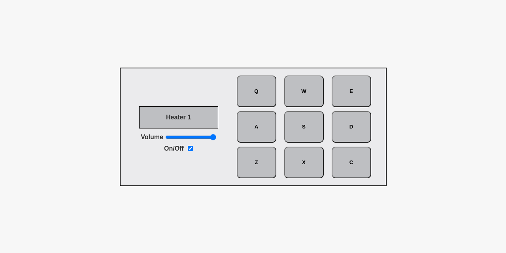

# Drum Machine 
Welcome to my drum machine project! This project is a simple web application built using React. The user can produce nine different drum sounds by either pressing one of the buttons or pressing a keyboard button associated with a button's label. Sliding the volume mixer adjusts the volume of the sound. Pressing the on/off checkbox toggles the functionality of the drum machine. 

## Webpage 
[GitHub Page](https://evanahdout.github.io/drum-machine/)

## Picture preview

